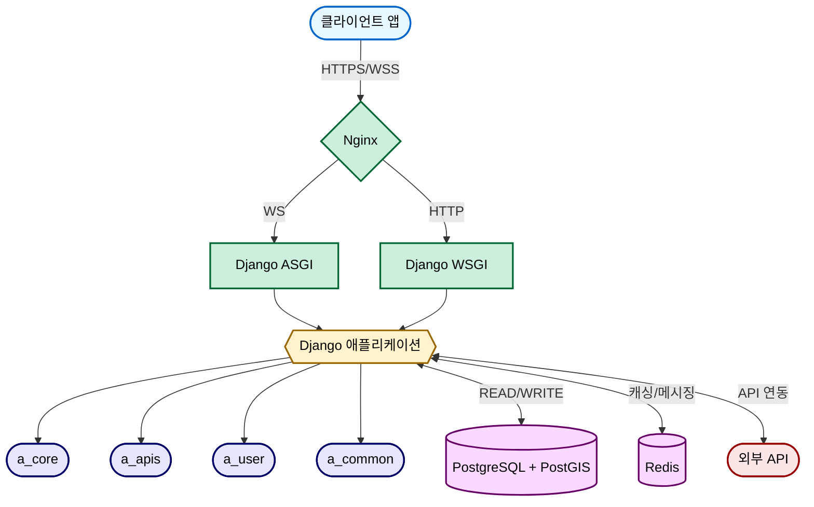
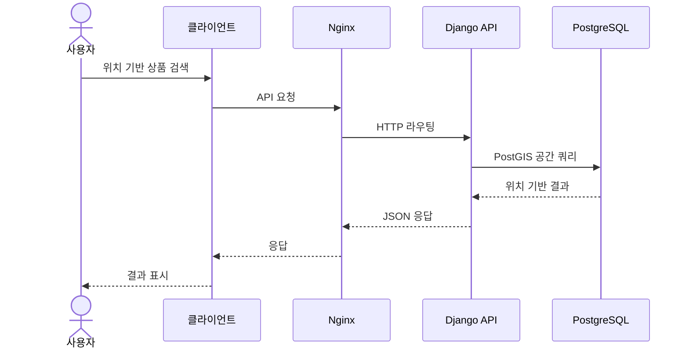

# 🛒 당마(DangMa) - 중고거래 플랫폼


## 📋 프로젝트 소개

**당마**는 위치 기반 중고 거래 플랫폼으로, Django 프레임워크를 활용한 백엔드 API 서버입니다. 사용자가 근처 이웃들과 중고 물품을 쉽게 거래할 수 있도록 도와주는 시스템을 구현했습니다.

### 주요 특징
- **위치 기반 서비스**: 사용자 위치를 기반으로 주변 상품 검색 및 활동 지역 설정
- **실시간 채팅**: WebSocket을 활용한 실시간 채팅 기능으로 판매자-구매자 간 소통
- **사용자 평가 시스템**: 매너온도와 리뷰를 통한 신뢰도 평가
- **API 기반 설계**: RESTful API 패턴을 통한 확장 가능한 서비스 구조
- **컨테이너 기반 배포**: Docker와 GitHub Actions를 활용한 CI/CD 파이프라인

## 🔧 기술 스택

### 백엔드
- **언어 & 프레임워크**: Python 3.12, Django 5.1.6
- **API**: REST Framework
- **데이터베이스**: PostgreSQL + PostGIS(위치 데이터)
- **비동기 처리**: Channels, Daphne (WebSocket)
- **인증**: JWT 토큰 기반 인증

### 인프라
- **컨테이너화**: Docker, Docker Compose
- **웹 서버**: Nginx
- **CI/CD**: GitHub Actions
- **SSL/TLS**: Let's Encrypt
- **배포 환경**: AWS

## 💻 주요 기능

### 1. 인증 및 사용자 관리
- JWT 기반 사용자 인증
- 이메일 인증 시스템
- 사용자 프로필 관리

### 2. 상품 관리
- 상품 등록, 수정, 삭제, 조회
- 카테고리별 상품 분류
- 가격 제안 시스템

### 3. 위치 기반 서비스
- 지역 인증 및 활동 지역 설정
- 반경 기반 근처 상품 검색
- 공간 데이터 활용 (SGIS API 연동)

### 4. 실시간 채팅
- WebSocket을 활용한 실시간 메시지
- 1:1 채팅방 관리
- 파일/이미지 전송 지원

### 5. 거래 관리
- 거래 약속 설정
- 거래 후기 및 평가
- 매너 온도 시스템

## 🗂️ 프로젝트 구조

```
당마(DangMa)/
├── django/                 # Django 애플리케이션
│   ├── a_core/             # 프로젝트 설정 및 코어
│   ├── a_apis/             # API 엔드포인트 및 비즈니스 로직
│   ├── a_user/             # 사용자 관련 기능
│   └── a_common/           # 공통 모듈 및 유틸리티
├── nginx/                  # Nginx 설정
└── scripts/                # 유틸리티 스크립트
```

## 🏗️ 시스템 아키텍처

당마 프로젝트는 마이크로서비스 지향적 아키텍처로 설계되어 있으며, Docker 컨테이너 기반으로 배포됩니다.



### 주요 컴포넌트 설명

1. **프론트엔드**: 웹/모바일 클라이언트 애플리케이션
2. **인프라 계층**:
   - **Nginx**: 리버스 프록시 및 로드 밸런서 역할, 정적 파일 제공
   - **Docker**: 컨테이너화된 서비스 관리
3. **백엔드 서버 계층**:
   - **Django ASGI (Daphne)**: WebSocket 처리, 실시간 채팅 기능
   - **Django WSGI (Gunicorn)**: HTTP API 요청 처리
4. **애플리케이션 계층**:
   - **a_core**: 프로젝트 핵심 설정 및 URL 라우팅
   - **a_apis**: API 엔드포인트, 모델, 서비스 로직
   - **a_user**: 사용자 관리 및 인증
   - **a_common**: 공통 유틸리티
5. **데이터 계층**:
   - **PostgreSQL + PostGIS**: 관계형 데이터베이스 + 지리 공간 데이터
   - **Redis**: 캐싱, 세션 관리, 실시간 채팅 채널 레이어

### 주요 기술 흐름도



### 보안 아키텍처

JWT 기반 인증 시스템과 쿠키 인증을 지원하며, 모든 통신은 HTTPS를 통해 암호화됩니다. 권한 기반 접근 제어를 통해 안전한 API 사용을 보장합니다.

## 🔍 주요 API 엔드포인트

### 인증 API
- `POST /api/auth/signup/`: 회원가입
- `POST /api/auth/login/`: 로그인
- `POST /api/auth/refresh/`: 토큰 갱신

### 사용자 API
- `GET /api/users/me/`: 내 정보 조회
- `PATCH /api/users/me/`: 내 정보 수정
- `GET /api/users/regions/`: 내 활동 지역 조회

### 상품 API
- `GET /api/products/`: 상품 목록 조회
- `POST /api/products/`: 상품 등록
- `GET /api/products/{id}/`: 상품 상세 조회
- `POST /api/products/{id}/interests/`: 관심 상품 등록/해제

### 채팅 API
- `GET /api/chats/rooms/`: 내 채팅방 목록
- `POST /api/chats/rooms/`: 채팅방 생성
- WebSocket 연결: `ws://domain/ws/chat/{room_id}/`

## 📊 ERD 설계


## 🚀 로컬 개발 환경 설정

### 사전 요구사항
- Python 3.12 이상
- Poetry
- Docker & Docker Compose

### 설치 및 실행

1. 레포지토리 클론
```bash
git clone https://github.com/yourusername/dangma.git
cd dangma
```

2. Poetry로 의존성 설치
```bash
poetry install
poetry shell
```

3. Django 설정
```bash
cd django
poetry run python manage.py makemigrations --settings=a_core.settings.development
poetry run python manage.py migrate --settings=a_core.settings.development
```

4. 개발 서버 실행
```bash
poetry run python manage.py runserver --settings=a_core.settings.development
```

5. API 문서 접속
```
https://api.dangma.store/api/docs#/
```

### Docker를 통한 실행
```bash
docker-compose up -d
```

## 🔄 CI/CD 워크플로우

GitHub Actions를 통한 CI/CD 파이프라인:
- develop → main 브랜치 병합 시 자동 배포
- 테스트 자동화 및 품질 검사
- Docker 이미지 빌드 및 배포
- 데이터베이스 마이그레이션 자동화

## 📝 성과 및 배운 점

- **확장 가능한 아키텍처 설계**: 마이크로서비스 지향적인 구조로 모듈 간 의존성 최소화
- **실시간 기능 구현**: WebSocket을 활용한 실시간 채팅 시스템 구축
- **공간 데이터 처리**: PostGIS를 활용한 위치 기반 검색 및 필터링 구현
- **CI/CD 자동화**: GitHub Actions을 활용한 배포 파이프라인 구축
- **보안 강화**: JWT 토큰 기반 인증 및 HTTPS 적용

## 📈 향후 개선 계획

- 알림 시스템 구축 (FCM, WebPush)
- 검색 기능 최적화 (Elasticsearch 도입)
- 마이크로서비스로의 점진적 전환
- 성능 모니터링 도입 (Prometheus, Grafana)

## 👨‍💻 연락처

- **개발자**: 이재훈
- **이메일**: ljhx6787@baver.com
- **GitHub**: https://github.com/Jeedoli
---

© 2025 당마(DangMa) 프로젝트
